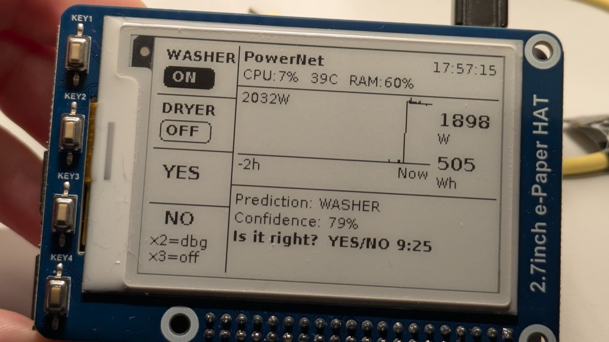

# powermeter-active-learner


<p align="center">
  
</p>
<p align="center"><em>Live on Raspberry Pi 3: washing machine detected at 1898W, multi-scale CNN prediction with 79% confidence, 2-hour consumption chart, human-in-the-loop feedback via physical buttons.</em></p>

## Overview

A domestic NILM (Non-Intrusive Load Monitoring) system with semi-supervised continuous learning, designed to run on a Raspberry Pi 3. The system disaggregates an aggregated power signal from a single smart plug to identify which appliances are active, using human-in-the-loop labeling to improve over time.

## Problem Statement

A single smart plug with a built-in power meter feeds both a washing machine and a tumble dryer. The system receives only the combined wattage as a time series. The goal is to disaggregate this signal and classify the current state into one of four categories:

- **Idle** -- neither appliance is running
- **Washing machine only**
- **Tumble dryer only**
- **Both** -- washing machine and tumble dryer running simultaneously

In particular, the system detects start/stop events for each appliance cycle.

## Device Naming

| Alias | Device | Role |
|-------|--------|------|
| **rpi-hassio** | Raspberry Pi running Home Assistant | Central home-automation hub. Receives power readings from the smart plug via Matter protocol and exposes them through a REST API. |
| **rpi-learner** | Raspberry Pi 3 with Waveshare e-Paper HAT | Runs the ML model, displays predictions on the e-ink screen, and collects user feedback via 4 physical buttons. |

## Data Flow

```
Smart plug (W) → Matter → rpi-hassio (Home Assistant) → REST API → rpi-learner
```

1. The smart plug reads real-time wattage and sends it to Home Assistant on `rpi-hassio` via Matter.
2. `rpi-learner` polls the HA REST API every 15 seconds to get the current wattage.
3. The inference pipeline classifies the state and shows the prediction on the e-ink display.
4. The user optionally provides labels (proactive) or feedback (reactive) via the physical buttons.
5. Labeled samples feed into the replay buffer for continuous online learning.

## Signal Model

```
P_obs(t) = P_wm(t) + P_td(t) + ε(t),    ε ~ N(0, σ²)
```

where `P_wm(t)` is the washing machine contribution, `P_td(t)` is the tumble dryer contribution, and `ε(t)` is additive Gaussian measurement noise.

## Inference Pipeline

Every 15 seconds (one tick), `rpi-learner` reads the current wattage and runs the following pipeline:

```
read_watts() → SignalWindow (40 samples, ~10 min)
  → Idle gate: max(window) < 15W? → IDLE, skip CNN
  → CNN ready? (2+ non-idle classes with >=5 samples) → PowerNet inference
  → Otherwise → BaselineDetector (threshold-based fallback)
  → Confidence blend (entropy + rolling accuracy)
  → Display update + optional reactive feedback prompt
```

### Three inference modes

| Mode | Condition | What happens |
|------|-----------|-------------|
| **Gate** | `max(window) < 15W` | Trivially IDLE. Skips CNN entirely, no reactive feedback prompted, confidence = 100%. Avoids wasting user attention on obvious idle states. |
| **Baseline** | CNN not ready or PyTorch unavailable | Threshold-based detector: `<100W` = IDLE, `100-1200W` = WASHER, `>1800W` = DRYER, high variance = BOTH. Uses 80W hysteresis band. |
| **PowerNet** | CNN ready (class diversity met) | Multi-scale 1D-CNN (4332 params) on 4 time windows (5min/30min/1h/2h). Outputs 4-class softmax. Confidence = 1 - normalized entropy. |

### Smart cold start

The CNN does **not** activate after a fixed sample count. Instead, it requires **class diversity**: at least 2 non-idle classes (e.g. WASHER + DRYER) with >= 5 labeled samples each in the replay buffer. This means the CNN typically activates after 1-2 appliance cycles (~1 week), rather than waiting for 100 total samples which would take months given that ~95% of readings are idle.

### Confidence display

The confidence percentage shown on the display is a **blend** that transitions over time:

| Feedback count | Shown |
|----------------|-------|
| < 25 evaluations | Mostly entropy-based (how "decided" the CNN is) |
| >= 25 evaluations | Mostly rolling accuracy (how often the CNN was right) |

During baseline mode, confidence is based on distance from the nearest decision threshold.

## ML Model

**PowerNet** -- multi-scale 1D-CNN for 4-class power state classification.

- Input: `[batch, 4, 20]` — 4 channels, 20 samples each
- **Multi-scale channels** (block-averaged downsampling to avoid aliasing):

| Channel | Window | Raw samples | Downsampled to | Captures |
|---------|--------|-------------|----------------|----------|
| 1 | 5 min | 20 @ 15s | 20 (raw) | Transients, on/off edges, power spikes |
| 2 | 30 min | 120 @ 15s | 20 (6x avg) | Cycle phase (wash vs spin vs rinse) |
| 3 | 1 hour | 240 @ 15s | 20 (12x avg) | Full appliance cycle shape |
| 4 | 2 hours | 480 @ 15s | 20 (24x avg) | Multi-appliance patterns (washer→dryer) |

- Architecture: `Conv1d(4→16, k=5) → MaxPool(2) → Conv1d(16→32, k=3) → MaxPool(2) → Linear(96→24) → Linear(24→4)`
- Total parameters: **4332** (< 10K budget for RPi 3)
- Training: AdamW + class-weighted CrossEntropyLoss `[0.3, 1.5, 1.5, 2.0]`
- Replay buffer: SQLite, FIFO 1000 samples, stratified class sampling

## Human-in-the-Loop Labeling

### Proactive labeling

The user presses a physical button when starting or stopping an appliance. This provides direct ground-truth labels. It is optional and opportunistic -- the system works without it, but labeled data improves the CNN.

### Reactive feedback

When the model makes a non-idle prediction, the display shows it with a 10-minute countdown. The user can confirm (OK) or reject (KO). If the window expires with no response, the sample remains unlabeled and is excluded from supervised training.

| Outcome | Training usage |
|---|---|
| OK within window | Positive reinforcement |
| KO within window | Hard negative correction |
| No feedback (window expired) | Unlabeled -- excluded from supervised training |
| Proactive label (button press) | Direct ground truth |

**Note:** The idle gate suppresses reactive feedback when consumption is near zero, so the user is only prompted for feedback on meaningful predictions.

## Setup (rpi-learner)

### Prerequisites

- Raspberry Pi 3 with Raspberry OS Lite (aarch64)
- Waveshare 2.7" e-Paper HAT V2 mounted and rotated 90 CCW (buttons on left)
- SPI enabled (`raspi-config` → Interfacing → SPI)
- Home Assistant reachable on the local network (HTTPS)

### Installation

```bash
# From the dev machine: sync code to the RPi
bash deploy/rsync.sh

# On the RPi: install dependencies
cd ~/powermeter-active-learner
bash deploy/install-rpi.sh

# Install PyTorch for CNN support (optional -- without it, BaselineDetector is used)
pip3 install torch==2.5.1 --index-url https://download.pytorch.org/whl/cpu --break-system-packages
```

### Home Assistant configuration

Create a `.env` file in the project root on the RPi:

```
HA_URL=https://<rpi-hassio-ip>:8123
HA_TOKEN=<your-long-lived-access-token>
HA_ENTITY_ID=sensor.<your_power_sensor>
```

- **HA_URL**: Home Assistant address (supports HTTPS with self-signed certificates)
- **HA_TOKEN**: Long-Lived Access Token (HA → Profile → Long-lived access tokens → Create token)
- **HA_ENTITY_ID**: entity_id of the power sensor (W) from your smart plug

Without `.env`, the system starts in simulation mode with `MockDataSource`.

The `.env` file is in `.gitignore` and is never committed.

### Systemd service (auto-start at boot)

```bash
# On the RPi: install and enable the service
cd ~/powermeter-active-learner
bash deploy/install-service.sh
```

Service management commands:

```bash
sudo systemctl status powermeter     # check status
sudo systemctl stop powermeter       # stop
sudo systemctl start powermeter      # start
sudo systemctl restart powermeter    # restart
sudo journalctl -u powermeter -f     # follow logs in real time
sudo journalctl -u powermeter --since "1 hour ago"  # recent logs
```

The service auto-restarts on failure after 10 seconds.

### Manual run (for development/debugging)

```bash
# Stop the service first if running
sudo systemctl stop powermeter

# Run manually with visible stdout
cd ~/powermeter-active-learner && python3 main.py
# Ctrl-C for clean shutdown (saves model checkpoint)
```

## E-Ink Display

The Waveshare 2.7" e-Paper HAT V2 is mounted in landscape (264x176 px) with the 4 physical buttons on the left side. The display uses fast refresh (no flash) for most updates, with a full refresh every ~10 minutes to clear ghosting.

```
 BTNS   CONTENT AREA
+------+-----------------------------------------+------+
|WASHER| PowerNet>Baseline           17:20:19    |      |
| [ON] | CPU:5%  42C  RAM:85%            [!]    |      |
|  DRY |-----------------------------------------|  0   |
| [OFF]|                                         |  W   |
|  YES |  ___/\___    /\  ← line chart (2h)      |      |
|      | /        \__/  \                        | 0.1  |
|  NO  |-----------------------------------------| Wh   |
|x2=dbg| Prediction: IDLE                        |      |
|x3=off| Confidence: 82%                         |      |
|      | Is it right?  YES/NO 9:45               |      |
+------+-----------------------------------------+------+
```

### Header (2 rows)

| Row | Content |
|-----|---------|
| 1 | Model info (left) + timestamp HH:MM:SS (right) |
| 2 | CPU%, temperature, RAM% (left) + error icon `[!]` if HA API fails (right) |

Model info shows: `Gate` (< 15W, trivially idle), `Baseline` (thresholds, CNN not ready), `PowerNet` (CNN active), or `PowerNet>Baseline` (CNN loaded but baseline active during cold start).

### Line chart (2 hours)

Line chart of watt consumption over the last 2 hours (480 samples at 15s intervals). Y-axis scales dynamically. Data is right-aligned ("Now" at right edge). The chart is **persisted to disk** every ~60s — after a reboot, the previous history is restored and gaps from downtime appear as breaks in the line.

### Right sidebar

Live watt reading (large) and cumulative Wh over the 2h window.

### Physical buttons

| Button | Label | Function |
|--------|-------|----------|
| KEY1 | **WASHER** | Toggle washer ON/OFF (proactive labeling) |
| KEY2 | **DRYER** | Toggle dryer ON/OFF (proactive labeling) |
| KEY3 | **YES** | Confirm model prediction (reactive feedback) |
| KEY4 | **NO** | Reject model prediction (reactive feedback) |
| KEY4 x2 | -- | **Debug screen**: double-click toggles developer view (class counts, loss, accuracy, drift, buffer fill). Double-click again to return. |
| KEY4 x3 | -- | **Safe poweroff**: triple-click triggers controlled shutdown. Display shows "POWER OFF / Unplug when green LED stops flashing". |

### Bottom area

| Row | Content |
|-----|---------|
| 1 | `Prediction: IDLE` (or WASHER / DRYER / BOTH) |
| 2 | `Confidence: 82%` — or feedback message ("YES sent!", "NO sent!") for 30s after pressing |
| 3 | `Is it right? YES/NO 9:45` — only shown when a prediction is pending feedback (10 min window) |

### Proactive labeling

Press **WASHER** when you start the washing machine, press again when it stops. Same for **DRYER** with the tumble dryer. Toggle state is shown as ON/OFF pills in the left column. Each press generates a ground-truth label for training. If you forget to press when the appliance stops, no negative feedback is generated -- you simply miss the stop-event label.

### Display optimizations

- **Fast refresh**: most updates use fast refresh (no flash). Full refresh every ~10 minutes to clear ghosting.
- **Anti-burn-in**: content shifted by random +/-2px on each refresh to prevent e-ink burn-in.
- **MicroSD preservation**: SQLite WAL mode + reduced fsync. Logs print every ~2.5 min unless non-idle event. Watt history saved every ~60s.
- **NTP sync**: checked at startup, logged if not synchronized.

## Repository Structure

```
powermeter-active-learner/
├── engine/                  # ML/NILM core
│   ├── data_source.py       # DataSource ABC + MockDataSource
│   ├── ha_source.py         # HomeAssistantDataSource (REST API, HTTPS)
│   ├── signal_pipeline.py   # SignalWindow + BaselineDetector
│   ├── model.py             # PowerNet (1D-CNN, 4708 params)
│   ├── replay_buffer.py     # ReplayBuffer (SQLite, FIFO 1000 samples)
│   ├── label_manager.py     # LabelManager (proactive + reactive)
│   ├── trainer.py           # Trainer (AdamW + weighted CrossEntropy)
│   └── confidence.py        # ConfidenceTracker + DriftDetector + confidence_blend
├── hat/                     # Waveshare e-Paper HAT interface
│   ├── epd.py               # EinkDisplay (landscape rotation, anti-burn-in, fast refresh)
│   ├── buttons.py           # ButtonHandler (GPIO interrupt KEY1-KEY4)
│   ├── ui.py                # UIState + render_frame (stateless renderer)
│   ├── demo.py              # Hello World standalone (hardware test)
│   └── vendor/              # Waveshare drivers (epd2in7_V2, epdconfig)
├── deploy/
│   ├── rsync.sh             # Sync dev machine → RPi
│   ├── install-rpi.sh       # Install RPi dependencies
│   ├── powermeter.service   # Systemd unit file
│   └── install-service.sh   # Install + enable systemd service
├── main.py                  # Main loop (15s tick, integrates everything)
├── .env                     # HA credentials (RPi only, in .gitignore)
├── requirements.txt         # Standard dependencies (torch, numpy)
└── requirements-rpi.txt     # RPi-specific dependencies (spidev, Pillow, gpiozero, rpi-lgpio)
```

## Project Status

**Engine ML**: complete. DataSource (abstract + mock + Home Assistant), SignalWindow, MultiScaleWindow (4 time scales with block-avg downsampling), BaselineDetector, PowerNet (multi-scale 1D-CNN, 4 channels, 4332 params), ReplayBuffer (SQLite), LabelManager, Trainer, ConfidenceTracker (entropy + rolling accuracy blend), DriftDetector (Page-Hinkley).

**Display + UI**: Waveshare 2.7" e-Paper V2 in landscape. 3-row status bar (watts, model, CPU/temp), sparkline chart (15 min), prediction with reactive feedback, proactive toggles. Fast refresh with periodic full refresh. Anti-burn-in pixel shift.

**Inference**: three-tier pipeline (idle gate → baseline → CNN). Smart cold start based on class diversity, not sample count. Idle gate suppresses CNN and feedback when consumption < 15W.

**Home Assistant**: REST API connection working (HTTPS, self-signed certs). Reads watts every 15s. Falls back to MockDataSource if `.env` is not configured.

**Deployment**: systemd service for auto-start at boot, auto-restart on failure.

**Pending**: prolonged field testing, additional appliance profiles.

## License

This project is licensed under the [GNU General Public License v3.0](LICENSE).
